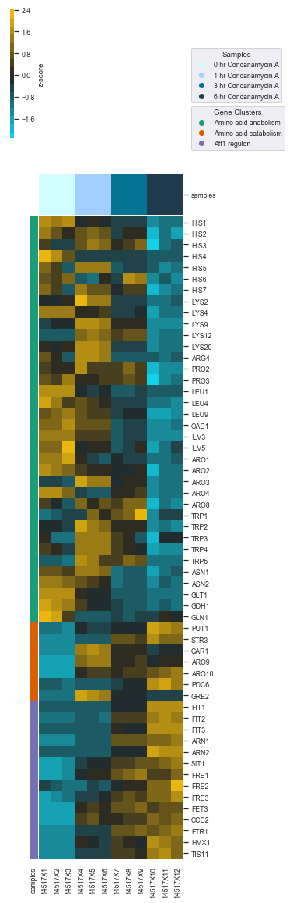
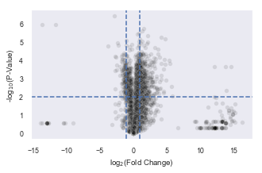
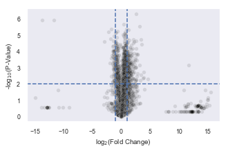
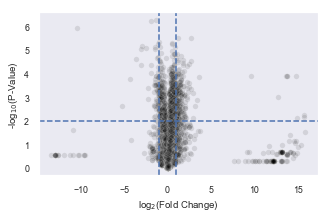
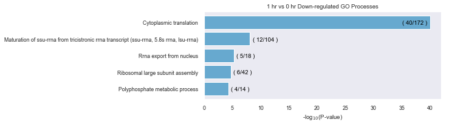
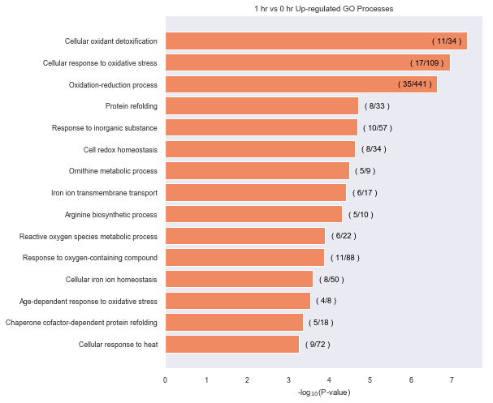
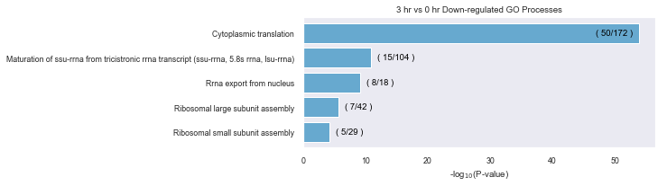
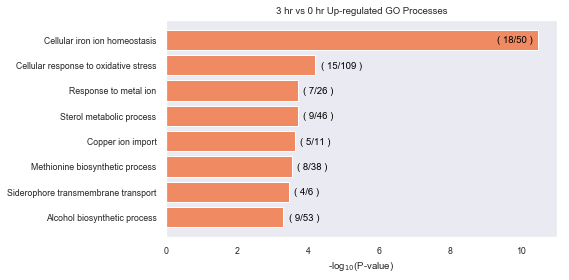
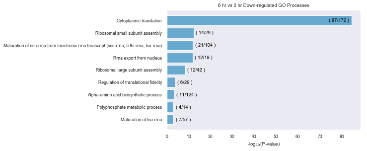
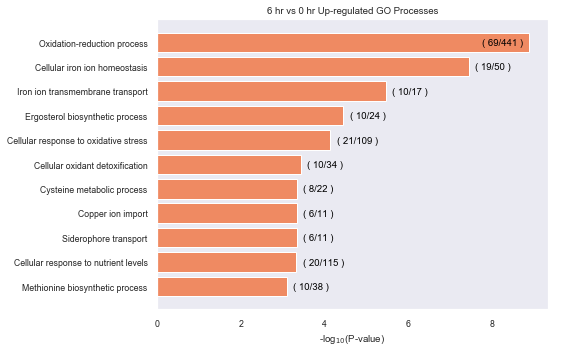

# Hughes, et al
The following notebook contains the code necessary for replicating the RNAseq analysis performed in the publication.   
   
<b>Read Processing</b>:   
<u>Sequencing</u>: Illumina TruSeq Stranded Total RNA with Ribo-Zero Yeast   
<u>Adaptors</u>: [AGATCGGAAGAGCACACGTCTGAACTCCAGTCA, AGATCGGAAGAGCGTCGTGTAGGGAAAGAGTGT]   
<u>Bioinformatics</u>: Raw counts files were processed by the University of Utah Bioinformatics Core.   
<u>Build</u>: Reads were aligned to S. cerevisiae Build sacCer3, R64-1-1 (Apr 2011)

### File path   
Users of this notebook should modify the path to specify the absolute path where this repository is downloaded   
path string must end with '/'


```python
path = '/Users/jordan/Desktop/collaborations/casey_collab/'
```

### Import dependencies and file path    
<a href='https://doi.org/10.5281/zenodo.2581692'>XPRESStools</a> is under development by Jordan A. Berg   


```python
import os, sys
import pandas as pd 
import numpy as np
from sklearn import preprocessing
import matplotlib
import matplotlib.pyplot as plt
%matplotlib inline

import xpresstools as xp
```

### Import raw read counts files and tabulate, normalize, and rename gene names

<b><u>Code Block #1</u></b>
1. File names are collected   
2. The first file is read into a dataframe with metadata   
3. Each subsequent file's count column is added column-wise to the dataframe   
4. File names are modified to remove file extension


```python
#Get file names
file_list = []
for subdir, dirs, files in os.walk(str(path + 'raw_data/')):
    for d in dirs:
        for subdir, dirs, files in os.walk(path + 'raw_data/' + d):
            for f in files:
                if f.endswith('.counts'):
                    file_list.append(path + 'raw_data/' + d + '/' + f)
                else:
                    pass
                
#Read in first file                
df = pd.read_csv(str(file_list[0]), sep='\t', comment='#') 
pos_starter = [0,5,6]
colname = df.columns[pos_starter]

df = df[colname]

#Read in remaining files
for f in file_list[1:]:
    df_pull = pd.read_csv(str(f), sep='\t', comment='#')
    df = pd.concat([df, df_pull[df_pull.columns[6]]], axis=1)
    del df_pull
    
#Modify sample names in dataframe
df.columns = df.columns.str.replace(".bam", "")
```

<b><u>Code Block #2</u></b>   
5. Remove gene lengths from count dataframe
6. Create reference dataframe with gene names and gene lengths for downstream use


```python
#Create counts table
df_counts = df.copy()
df_counts = df_counts.drop(labels='Length', axis=1)
df_counts = df_counts.set_index('Geneid')
del df_counts.index.name

#Create gene length reference for downstream RPKM normalization
df_length = df.copy()
df_length = df_length.loc[:, 'Geneid':'Length']
df_length = df_length.set_index('Geneid')
del df_length.index.name
```

<b><u>Code Block #3</u></b>   
7. Perform RPKM normalization on count dataframe


```python
#Perform RPKM normalization using gene length reference
df_rpm = df_counts / (df_counts.sum() / 1e6)
df_rpkm = df_rpm.div(df_length.Length, axis=0)
df_rpkm = df_rpkm.dropna(axis=0)

#Print some info
print('Shape before normalization: ' + str(df_counts.shape))
print('Shape after normalization: ' + str(df_rpkm.shape))
```

    Shape before normalization: (6219, 12)
    Shape after normalization: (6219, 12)


<b><u>Code Block #6</u></b>   
11. Import RNAseq metadata needed for later analysis   
12. Create a samples color palette 


```python
#Import file with metadata
info = pd.read_csv(path + 'metadata/info_table.csv', header=None)
info_original = info

#Combine labels
info[1] = info[1] + '_time' + info[2].astype(str) + "_rep" + info[3]

#Keep relevant metadata
info_pos = [0,1]
info_colname = info.columns[info_pos]
info = info[info_colname]

#Get list of merged samples names
info_original[1] = info_original[2]
info_ch = info_original[[0,1]]
conA = list(info[1])[0:12]

#Create a samples color dictionary for plots
colors = {'0 hr Concanamycin A':'#d0fefe',
       '1 hr Concanamycin A':'#a2cffe',
       '3 hr Concanamycin A':'#047495',
       '6 hr Concanamycin A':'#1f3b4d'}
```

<b><u>Code Block #7</u></b> 
13. Order columns of dataframe


```python
#Specify column order for dataframe
col_order = ['14517X1',
             '14517X2',
             '14517X3',
             '14517X4',
             '14517X5',
             '14517X6',
             '14517X7',
             '14517X8',
             '14517X9',
             '14517X10',
             '14517X11',
             '14517X12']

df_conA_sort = df_rpkm.reindex(col_order, axis=1)
```

<b><u>Code Block #8</u></b> 
14. Export counts and RPKM tables


```python
#Output counts tables for each dataset (no renaming of genes)
df_counts.to_csv(path + 'processed_data/conA_counts.csv')
df_rpkm.to_csv(path + 'processed_data/conA_rpkm.csv')
```

<b><u>Code Block #9</u></b>   
15. Scale genes (mean=0, stdev=1 per gene) 


```python
#Scale gene rows
df_conA_scaled = df_conA_sort.copy()
df_conA_scaled = df_conA_scaled.dropna()
df_conA_scaled[df_conA_scaled.columns] = preprocessing.scale(df_conA_scaled[df_conA_scaled.columns], axis=1)

#Print some info        
print('Dataframe size before scaling: ' + str(df_conA_sort.shape))
print('Dataframe size after scaling: ' + str(df_conA_scaled.shape))
```

    Dataframe size before scaling: (6219, 12)
    Dataframe size after scaling: (6219, 12)


### Curated Amino Acid Gene List Heatmap


```python
#Get genes of interest for heatmap
genes = pd.read_csv(path + 'metadata/gene_list_v3.csv')
genes_info = genes[['gene_id','function']]
genes_info.columns = [0,1]

#Get common names for conversion
genes_common = genes[['gene_name','function']]
genes_common.columns = [0,1]

#Get dataframe of gene cohort of interest
df_plot = df_conA_scaled.loc[genes_info[0].tolist()]
print('Size of gene cohort data matrix:' + str(df_plot.shape))

#Rename gene ids to common names
labels = pd.Series(genes['gene_name'].values,index=genes['gene_id']).to_dict()
df_plot['name'] = df_plot.index.map(labels.get)
df_plot = df_plot.set_index('name')
del df_plot.index.name

#Set dictionary of gene color legend
gene_colors = {'Amino acid anabolism':'#1b9e77', 'Amino acid catabolism':'#d95f02', 'Aft1 regulon':'#7570b3'}

#Plot heatmap
xp.heatmap(df_plot, info_ch, sample_palette=colors, gene_palette=gene_colors,
    gene_info=genes_common, figsize=(4,20),
    row_cluster=False, col_cluster=False,
          cbar_kws={'label': 'z-score'})

#Format legends
import matplotlib
import matplotlib.pyplot

f = lambda m,c: plt.plot([],[],marker='o', color=c, ls="none")[0]
handles = [f("s", list(gene_colors.values())[i]) for i in range(len(list(gene_colors.values())))]
first_legend = plt.legend(handles, list(gene_colors.keys()), bbox_to_anchor=(50, 0.25), loc=2, borderaxespad=0., title='Gene Clusters')

# Add the legend manually to the current Axes.
ax = plt.gca().add_artist(first_legend)

g = lambda m,c: plt.plot([],[],marker='o', color=c, ls="none")[0]
handles_g = [f("s", list(colors.values())[i]) for i in range(len(list(colors.values())))]
plt.legend(handles_g, list(colors.keys()), bbox_to_anchor=(50, .7), loc=2, borderaxespad=0., title='Samples')

#Save and show figure
plt.savefig(path + 'plots/gene_list_heatmap_final.pdf',dpi=1200,bbox_inches='tight')
plt.show()
```

    Size of gene cohort data matrix:(57, 12)


    <Figure size 432x288 with 0 Axes>





### GO Term Analysis

<u><b>Perform statistical analysis of significant genes </b></u>


```python
print('6v0')
xp.volcano(df_rpkm, info, 'Concanamycin_A_time6', 'Concanamycin_A_time0', 
           alpha=.1, y_threshold=2, x_threshold=[-1,1], 
           figsize=(5,3), dpi=1200,
           save_fig=str(path + 'plots/de/conA_6v0.pdf'),
           save_threshold_hits=path + 'plots/go/data/conA_6v0_threshold.csv')
print('3v0')
xp.volcano(df_rpkm, info, 'Concanamycin_A_time3', 'Concanamycin_A_time0', 
           alpha=.1, y_threshold=2, x_threshold=[-1,1],
           figsize=(5,3), dpi=1200,
           save_fig=str(path + 'plots/de/conA_3v0.pdf'),
           save_threshold_hits=path + 'plots/go/data/conA_3v0_threshold.csv')
print('1v0')
xp.volcano(df_rpkm, info, 'Concanamycin_A_time1', 'Concanamycin_A_time0', 
           alpha=.1, y_threshold=2, x_threshold=[-1,1],
           figsize=(5,3), dpi=1200,
           save_fig=str(path + 'plots/de/conA_1v0.pdf'),
           save_threshold_hits=path + 'plots/go/data/conA_1v0_threshold.csv')
```

    6v0


    <Figure size 432x288 with 0 Axes>





    3v0


    <Figure size 432x288 with 0 Axes>





    1v0


    <Figure size 432x288 with 0 Axes>





<b><u>Plot enriched GO terms from analysis</u></b>   
Took up- and down-regulated lists from each threshold list and ran on geneontology.org   
Test Type: Fisher's Exact    
Correction: Calculate False Discovery Rate   
Only hits with a fold change over expected greater than 1 are displayed in the plots    
GO Analysis was performed 22 Mar 2019, using PANTHER Overrepresentation Test v14.0 and Gene Ontology v1.2 (Released 2019-01-01)   
   
<u>Citations</u>:   
Ashburner et al. Gene ontology: tool for the unification of biology. Nat Genet. May 2000;25(1):25-9.   
The Gene Ontology Consortium. The Gene Ontology Resource: 20 years and still GOing strong. Nucleic Acids Res. Jan 2019;47(D1):D330-D338.    
Mi H, Huang X, Muruganujan A, Tang H, Mills C, Kang D, Thomas PD. PANTHER version 11: expanded annotation data from Gene Ontology and Reactome pathways, and data analysis tool enhancements. Nucleic Acids Res. Jan 2017;45(D1):D183-D189.   

<b><u>1 hr vs 0 hr GO analysis</u></b>


```python
#Import data
down1 = pd.read_csv(path + 'plots/go/data/conA_1v0_threshold_down.csv')
up1 = pd.read_csv(path + 'plots/go/data/conA_1v0_threshold_up.csv')

#Format
down1 = down1.dropna()
up1 = up1.dropna()

down1['GO biological process complete'] = down1['GO biological process complete'].str.capitalize()
up1['GO biological process complete'] = up1['GO biological process complete'].str.capitalize()

down1['raw P value'] = -np.log10(down1['raw P value'])
up1['raw P value'] = -np.log10(up1['raw P value'])

#Sort numerically for plotting
down1= down1.sort_values(by=['raw P value'])
up1 = up1.sort_values(by=['raw P value'])
```


```python
#Initialize figure
fig, ax = plt.subplots(figsize=(7,down1.shape[1]/3))
ax.grid(False)

# Get data in arrays
y = np.array(down1['GO biological process complete'].tolist())
x = np.array(down1['raw P value'].tolist()).astype(np.float)

#Create labels for actual / expected members per GO term
y2_labels = []
for index, row in down1.iterrows():
    y2_labels.append('( ' + str(int(row[2])) + '/' + str(int(row[1])) + ' )')
    
#Plot
ax.barh(y, x, align='center', color='#67a9cf', ecolor='black')
ax.set_xlabel('-log$_1$$_0$(P-value)')
ax.set_title('1 hr vs 0 hr Down-regulated GO Processes')

#Add additional labels
for i, l in enumerate(x):
    if i == 4:
        ax.text(l - .45, i - .12, str(y2_labels[i]), color='black', horizontalalignment='right')
    else:
        ax.text(l + .45, i - .12, str(y2_labels[i]), color='black', horizontalalignment='left')

plt.savefig(path + 'plots/go/1hr_go_down.pdf',dpi=1200, bbox_inches='tight')
```





```python
fig, ax = plt.subplots(figsize=(7,up1.shape[1]))
ax.grid(False)

y = np.array(up1['GO biological process complete'].tolist())
x = np.array(up1['raw P value'].tolist()).astype(np.float)

y2_labels = []
for index, row in up1.iterrows():
    y2_labels.append('( ' + str(int(row[2])) + '/' + str(int(row[1])) + ' )')

ax.barh(y, x, align='center', color='#ef8a62', ecolor='black')
ax.set_xlabel('-log$_1$$_0$(P-value)')
ax.set_title('1 hr vs 0 hr Up-regulated GO Processes')

for i, l in enumerate(x):
    if i < 12:
        ax.text(l + .15, i - .12, str(y2_labels[i]), color='black', horizontalalignment='left')
    else:
        ax.text(l - .15, i - .12, str(y2_labels[i]), color='black', horizontalalignment='right')

plt.savefig(path + 'plots/go/1hr_go_up.pdf',dpi=1200, bbox_inches='tight')
```





<b><u>3 hr vs 0 hr GO analysis</u></b>


```python
#Import data
down3 = pd.read_csv(path + 'plots/go/data/conA_3v0_threshold_down.csv')
up3 = pd.read_csv(path + 'plots/go/data/conA_3v0_threshold_up.csv')

#Format
down3 = down3.dropna()
up3 = up3.dropna()

down3['GO biological process complete'] = down3['GO biological process complete'].str.capitalize()
up3['GO biological process complete'] = up3['GO biological process complete'].str.capitalize()

down3['raw P value'] = -np.log10(down3['raw P value'])
up3['raw P value'] = -np.log10(up3['raw P value'])

#Sort numerically for plotting
down3= down3.sort_values(by=['raw P value'])
up3 = up3.sort_values(by=['raw P value'])
```


```python
fig, ax = plt.subplots(figsize=(7,down3.shape[1]/3))
ax.grid(False)

y = np.array(down3['GO biological process complete'].tolist())
x = np.array(down3['raw P value'].tolist()).astype(np.float)

y2_labels = []
for index, row in down3.iterrows():
    y2_labels.append('( ' + str(int(row[2])) + '/' + str(int(row[1])) + ' )')
    
ax.barh(y, x, align='center', color='#67a9cf', ecolor='black')
ax.set_xlabel('-log$_1$$_0$(P-value)')
ax.set_title('3 hr vs 0 hr Down-regulated GO Processes')

for i, l in enumerate(x):
    if i == 4:
        ax.text(l - 1, i - .08, str(y2_labels[i]), color='black', horizontalalignment='right')
    else:
        ax.text(l + 1, i - .08, str(y2_labels[i]), color='black', horizontalalignment='left')

plt.savefig(path + 'plots/go/3hr_go_down.pdf',dpi=1200, bbox_inches='tight')
```





```python
fig, ax = plt.subplots(figsize=(7,up1.shape[1]/2))
ax.grid(False)

y = np.array(up3['GO biological process complete'].tolist())
x = np.array(up3['raw P value'].tolist()).astype(np.float)

y2_labels = []
for index, row in up3.iterrows():
    y2_labels.append('( ' + str(int(row[2])) + '/' + str(int(row[1])) + ' )')

ax.barh(y, x, align='center', color='#ef8a62', ecolor='black')
ax.set_xlabel('-log$_1$$_0$(P-value)')
ax.set_title('3 hr vs 0 hr Up-regulated GO Processes')

for i, l in enumerate(x):
    if i == 7:
        ax.text(l - .15, i - .12, str(y2_labels[i]), color='black', horizontalalignment='right')
    else:
        ax.text(l + .15, i - .12, str(y2_labels[i]), color='black', horizontalalignment='left')

plt.savefig('plots/go/3hr_go_up.pdf',dpi=1200, bbox_inches='tight')
```





<b><u>6 hr vs 0 hr GO analysis</u></b>


```python
#Import data
down6 = pd.read_csv(path + 'plots/go/data/conA_6v0_threshold_down.csv')
up6 = pd.read_csv(path + 'plots/go/data/conA_6v0_threshold_up.csv')

#Format
down6 = down6.dropna()
up6 = up6.dropna()

down6['GO biological process complete'] = down6['GO biological process complete'].str.capitalize()
up6['GO biological process complete'] = up6['GO biological process complete'].str.capitalize()

down6['raw P value'] = -np.log10(down6['raw P value'])
up6['raw P value'] = -np.log10(up6['raw P value'])

#Sort numerically for plotting
down6= down6.sort_values(by=['raw P value'])
up6 = up6.sort_values(by=['raw P value'])
```


```python
fig, ax = plt.subplots(figsize=(7,down3.shape[1]/1.8))
ax.grid(False)

y = np.array(down6['GO biological process complete'].tolist())
x = np.array(down6['raw P value'].tolist()).astype(np.float)

y2_labels = []
for index, row in down6.iterrows():
    y2_labels.append('( ' + str(int(row[2])) + '/' + str(int(row[1])) + ' )')
    
ax.barh(y, x, align='center', color='#67a9cf', ecolor='black')
ax.set_xlabel('-log$_1$$_0$(P-value)')
ax.set_title('6 hr vs 0 hr Down-regulated GO Processes')

for i, l in enumerate(x):
    if i == 8:
        ax.text(l - 1, i - .12, str(y2_labels[i]), color='black', horizontalalignment='right')
    else:
        ax.text(l + 1, i - .12, str(y2_labels[i]), color='black', horizontalalignment='left')

plt.savefig(path + 'plots/go/6hr_go_down.pdf',dpi=1200, bbox_inches='tight')
```





```python
fig, ax = plt.subplots(figsize=(7,up1.shape[1]/1.5))
ax.grid(False)

y = np.array(up6['GO biological process complete'].tolist())
x = np.array(up6['raw P value'].tolist()).astype(np.float)

y2_labels = []
for index, row in up6.iterrows():
    y2_labels.append('( ' + str(int(row[2])) + '/' + str(int(row[1])) + ' )')

ax.barh(y, x, align='center', color='#ef8a62', ecolor='black')
ax.set_xlabel('-log$_1$$_0$(P-value)')
ax.set_title('6 hr vs 0 hr Up-regulated GO Processes')

for i, l in enumerate(x):
    if i == 10:
        ax.text(l - .15, i - .12, str(y2_labels[i]), color='black', horizontalalignment='right')
    else:
        ax.text(l + .15, i - .12, str(y2_labels[i]), color='black', horizontalalignment='left')

plt.savefig(path + 'plots/go/6hr_go_up.pdf',dpi=1200, bbox_inches='tight')
```





```python

```
